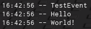

# Function Hooks

While metamethod hooks may be very useful, there is also situations where we want to directly hook functions as well. An example of this might be `FireServer`, where some game scripts cache the result from `__index` at boot to prevent metamethod hooks from working.

The old method to bypass this was to have your script run very early (i.e before the game loads), but now we have better methods to allow this.

Lets show an example of function hooking and explain each line.

```lua
local OldFireServer
OldFireServer = hookfunction(Instance.new'RemoteEvent'.FireServer, newcclosure(function(Event, ...)
    return OldFireServer(Event, ...)
end))
```

```lua
local OldFireServer
```

This will declare a local that will be used to store the original `FireServer` function. You need to declare this a line before your `hookfunction` call as this local will become an upvalue in the resulting hook.

```lua
OldFireServer = hookfunction(Instance.new'RemoteEvent'.FireServer, newcclosure(function(Event, ...)
    return OldFireServer(Event, ...)
end))
```

This will actually hook the `FireServer` function with the function returned from `newcclosure`, and set the original function into the `OldFireServer` variable.

**Note**: `hookfunction` will automatically convert the hook you pass into `newcclosure`'d form, meaning it isn't required for you to call `newcclosure`. It is still good form to do so, though. **Important Note**: Never call hookfunction with a metamethod, as it can cause instability issues. Always use the technique shown in [metamethod hooks](./metamethod_hook_examples.md) instead.

## Function Hooking Examples

Lets expand our FireServer hook to act as a RemoteEvent logger:

```lua
local OldFireServer
OldFireServer = hookfunction(Instance.new'RemoteEvent'.FireServer, newcclosure(function(Event, ...)
    if not checkcaller() then
        local Args = {...}

        print(Event)
        for I, V in pairs(Args) do
            print(V)
        end
    end

    return OldFireServer(Event, ...)
end))
```

This will now print out the event who called FireServer and the arguments passed to it whenever it is called.



Lets now show how to use the [Synapse X Decompiler](./decompiler.md).