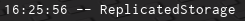

# Metamethod Hook Examples

Lets now expand on the example script that we were shown in 3.2 and add some actual functionality for it.

```lua
local LocalPlayer = game:GetService("Players").LocalPlayer
local OldIndex = nil

OldIndex = hookmetamethod(game, "__index", function(Self, Key)
    if not checkcaller() and Self == LocalPlayer and Key == "Character" then
        return nil
    end

    return OldIndex(Self, Key)
end)
```
Let us now explain the new lines we added.

```lua
local LocalPlayer = game:GetService("Players").LocalPlayer
```
This will grab the LocalPlayer for later on in the script.

```lua
if not checkcaller() and Self == LocalPlayer and Key == "Character" then
    return nil
end
```
This line has a few checks, but most importantly a call to `checkcaller`. `checkcaller` allows you to see if the thread calling your hook is a Synapse X thread or not, and modify its behavior based on that. This is *really important* for many hooks, as most of the time you do not want a hook to be executed if on a Synapse X thread.

If that check passes (not a Synapse X thread), we then check if they were trying to index a LocalPlayer with the field `Character`, then return nil.

Lets now try that script that we previously explained on the metatables page:

```lua
print(game:GetService("Players").LocalPlayer.Character)
```
If we execute it within a game LocalScript, we get the result we wished:


Voila! We have successfully intercepted a metamethod index and replaced it with our own values. The possibilities that we can do with this now are near limitless.
## `__namecall` Hook Examples

Lets now do a hook for the `__namecall` method, based on the same script as before.

```lua
local ReplicatedStorage = game:GetService("ReplicatedStorage")
local OldNameCall = nil

OldNameCall = hookmetamethod(game, "__namecall", function(Self, ...)
    local Args = {...}
    local NamecallMethod = getnamecallmethod()

    if not checkcaller() and Self == game and NamecallMethod == "GetService" and Args[1] == "Workspace" then
        return ReplicatedStorage
    end

    return OldNameCall(Self, ...)
end)
```

Let us now explain the new lines we added.

```lua
local ReplicatedStorage = game:GetService("ReplicatedStorage")
```

This will grab the ReplicatedStorage service for later on in the script.

```lua
local Args = {...}
```

This will get a list of arguments to the function called.

```lua
if not checkcaller() and Self == game and NamecallMethod == "GetService" and Args[1] == "Workspace" then
    return ReplicatedStorage
end
```

The same `checkcaller` check applies here, but we have a few more checks within this conditional:
* The `Self == game` check will make sure the object passed is `game` (this prevents someone from doing `workspace:GetService("Workspace")` and getting the hooked result)
* The `NamecallMethod == "GetService"` check will make sure the function being called is `GetService`.
* The `Args[1] == "Workspace"` check will make sure the first argument passed is `Workspace`.

If all of those conditions pass, we return ReplicatedStorage instead of Workspace.

Lets run an example script to show this

```lua
print(game:GetService("Workspace"))
```

If we execute it within a game LocalScript, we get the result we wanted again:



Lets now move on to [function hooking](./function_hooks.md).