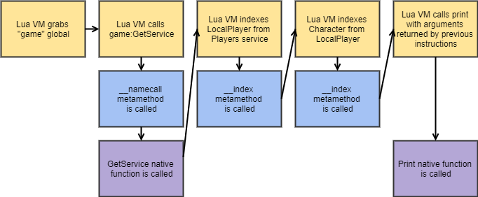

# Objects and Metatables

When you create an instance with `Instance.new`, internally it creates an 'Object'. Every instance in the game is an object - `game`, `workspace`, `game:GetService("ReplicatedStorage")`, or any other instance is an object. There is a cool thing with all of these objects though - they all **have the same metatable**.

You may be asking - *what is a metatable*? Fear not, as we will now be diving deep into how metatables work and why they are so important for development with Synapse X.

## Metatables

Metatables serve an extremely important purpose in both Lua and Synapse X - they allow for logic to be put behind regular tables, allowing for powerful programming constructs that are extensively used throughout the game engine.

But for Synapse X, they allow something even more powerful - lets look at an example script and explain the process of how it executes:
```lua
print(game:GetService("Players").LocalPlayer.Character)
```


We will take a particular look at the blocks highlighted in blue - those are metamethod calls, and Synapse X has a special feature for metamethod calls - we can **hook them**.

## Metamethod Hooking

Metamethods are a particular feature of metatables which allow Lua functions to be called when someone tries to do certain operations with our metatable. We will be using that fact to replace the function used for the **object metatable**.

## Simple metamethod hook

The following script is the base script used for metamethod hooking on Synapse X. We will explain this script line by line.

```lua
local OldIndex = nil
local OldNameCall = nil

OldIndex = hookmetamethod(game, "__index", newcclosure(function(...)
    local Self, Key = ...
    return OldIndex(...)
end))

OldNameCall = hookmetamethod(game, "__namecall", newcclosure(function(...)
    local Self = ...
    local NamecallMethod = getnamecallmethod()

    return OldNameCall(...)
end))
```

```lua
local OldIndex = nil
local OldNameCall = nil
```

This declares the original functions we will call later.

```lua
OldIndex = hookmetamethod(game, "__index", newcclosure(function(...)
    local Self, Key = ...
    return OldIndex(...)
end))
```

This has three parts - the `hookmetamethod` call, the `newcclosure` call, and the actual hook itself. This hooks the `__index` metamethod, which is called whenever someone indexes a object. (`game.Workspace` for example)

Its also ***really important*** to declare these functions as vararg and pass their arguments as such, or detection methods can arise.

```lua
OldNameCall = hookmetamethod(game, "__namecall", newcclosure(function(...)
    local Self = ...
    local NamecallMethod = getnamecallmethod()

    return OldNameCall(...)
end))
```

This is the same as the above hook, but will replace `__namecall`, which is used for calls with self. (`game:GetService("Workspace")` for example)

The `getnamecallmethod` call is needed so we can get the function name which we will use later in this tutorial. (in the above case, `NamecallMethod` would be `GetService`)

We will now be taking a detour to explain [how newcclosure works](./newcclosure.md), which is important to understand for later parts of this tutorial.