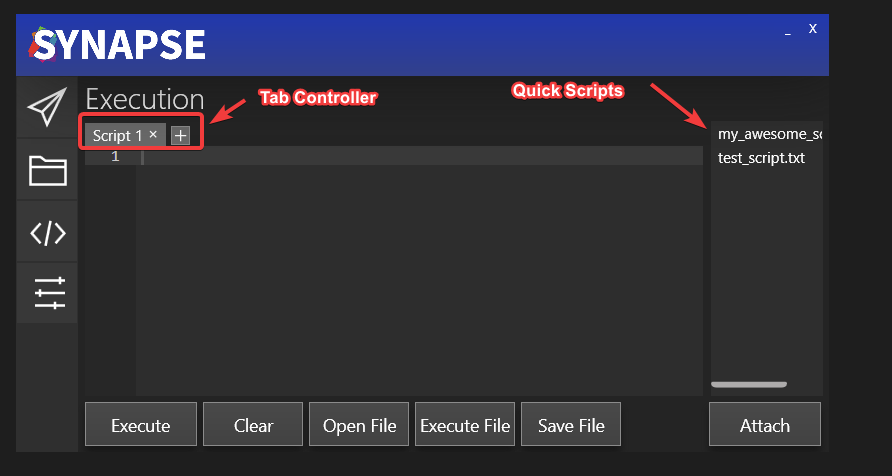
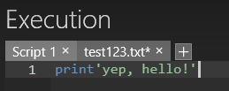
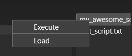

# Synapse X User Interface

The Synapse X user interface was designed to be easy to use, but have powerful features to make your experience better. The picture below shows the main user interface and its features.

## Execution Tab

The Tab Controller allows you to have multiple scripts open at once within the Synapse X UI. It also has some useful features - if you open a file (with either the `Open File` button or `Ctrl+O`) & then edit the file in the editor, a star will appear to show you that you have modified the file from its original contents.

You can then press `Ctrl+S` to save the file back to disk.

Synapse X also has the feature of 'Quick Scripts' - you can place any script into the `scripts` folder within your Synapse X installation and it will automatically appear within the UI. You can then right click to either execute the script or load it into the editor.

There is also the `autoexec` folder, which will automatically be executed whenever you attach Synapse X or are teleported while attached. This is useful for custom global functions & other scripts you always want to be executed when you attach.

## Options Tab

The options tab allows you to configure a multitude of settings for Synapse X, which will be explained in the [next page](./options.md).