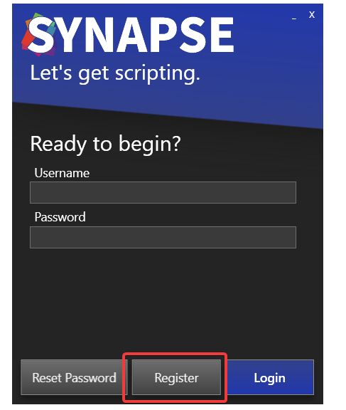

# Creating a Synapse X Account

To start, we can now open '`Synapse X.exe`' and accept the prompt to install Synapse X in this directory.

After the initial loading phase, you should now see a login screen. We do not have an account yet, so click on 'Register'.

We can now fill in our registration information - email address, username, password, and the serial key that you got in your purchase email.

**IMPORTANT**: Make sure you enter a real email address for the email field! Do not use temporary mail services, as the only way to recover your Synapse X account in case you lose it is via the email you initially entered.

After you verified all the information you entered is correct, click on 'Register'. It might take a few seconds to register your account - a success screen should appear if you did all the previous steps correctly.

Installation of Synapse X after this point may take a few minutes depending on your internet speed, as Synapse X has to download files required for its execution.

If everything went well, you can move on to [general usage](../general/general_usage.md). If not, read the troubleshooting section below.

## Troubleshooting

If you get an error when you click register, it usually is because you either already have an account registered (in that case, just login with the account you already made), or you have an invalid serial key. Make sure you buy a Synapse X key from official sources ([https://x.synapse.to](https://x.synapse.to)) to prevent the latter from occurring.

If you get a stuck grey screen after Synapse X gets to '`Ready`', install the following update files below & the issue should fix itself:

[File #1](https://aka.ms/vs/16/release/vc_redist.x86.exe)

[File #2](https://aka.ms/vs/16/release/vc_redist.x64.exe)

A variety of other issues have fixes on the [FAQ document](https://docs.google.com/document/d/1cPYeVVJiVilvnr80crDe4apRYHuwMlz0w17dsPuV3fI/edit).