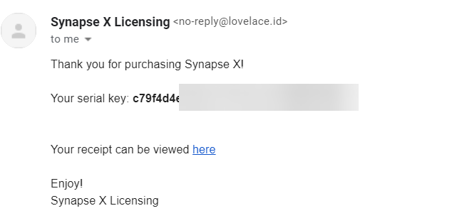

# Installation

After you purchase Synapse X, you will get an email with your serial key. Its important you do not share this key or someone could steal your license. An example email is shown below:

We now want to download the Synapse X client. You can download it by going to https://x.synapse.to/ and downloading & extracting the zip file from there. We will now whitelist the folder from anti-virus detections, which could cause issues later on if we do not do so.

Proceed to [whitelisting from anti-virus software](./whitelist_av.md).