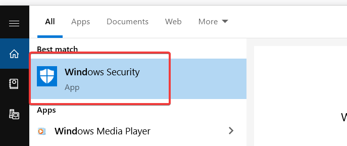
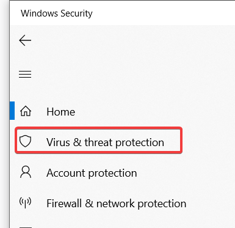
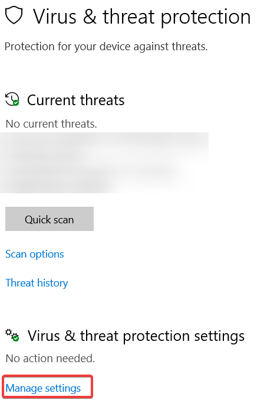
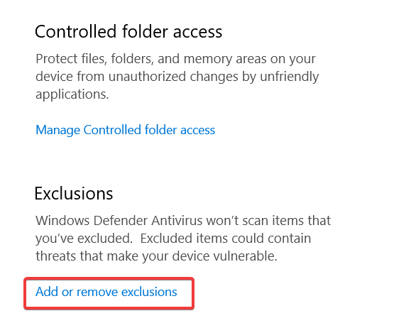
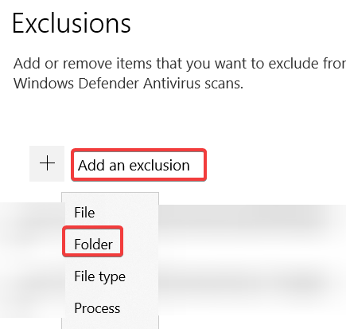

# Whitelisting from Anti-Virus Software

Unfortunately, anti-virus software has always been a problem for Synapse X to the nature of how it works - Synapse X uses techniques that are also commonly used by malicious programs, which causes false positives in anti-virus software.

We will be showing you how to whitelist Synapse X's folder in Windows Defender, which is the most commonly found anti-virus on Windows machines. If you use a different anti-virus (Norton, Malwarebytes, etc.) whitelist the Synapse X folder then proceed to the [creating your Synapse X account](./account_creation.md) step. If not though, follow the instructions below.

First, go to the 'Windows Security' app from the start menu.

Next, go to the 'Virus & threat protection' tab.

Click on 'Manage settings'.

Now, scroll down to 'Add or remove exclusions'.

Finally, click 'Add an exclusion', 'Folder', and select the directory that we extracted from the zip file earlier.

You have now successfully whitelisted the Synapse X folder from Windows Defender. We can now move on to actually [installing Synapse X](./account_creation.md).