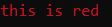

# Console Functions

## Console Print
```syn
<void> rconsoleprint(<string> message)
```
Prints `message` into the console. `rconsoleprint` also supports colors.
### Example
```syn
rconsoleprint('@@RED@@')
rconsoleprint('this is red')
```
### Console Output


### Colors       
| Color         | Code              |
----------------|-------------------|
|Black          |@@BLACK@@          |
|Blue           |@@BLUE@@           |
|Green          |@@GREEN@@          |
|Cyan           |@@CYAN@@           |
|Red            |@@RED@@            |
|Magenta        |@@MAGENTA@@        |
|Brown          |@@BROWN@@          |
|Light Gray     |@@LIGHT_GRAY@@     |
|Dark Gray      |@@DARK_GRAY@@      |
|Light Blue     |@@LIGHT_BLUE@@     |
|Light Green    |@@LIGHT_GREEN@@    |
|Light Cyan     |@@LIGHT_CYAN@@     |
|Light Red      |@@LIGHT_RED@@      |
|Light Magenta  |@@LIGHT_MAGENTA@@  |
|Yellow         |@@YELLOW@@         |
|White          |@@WHITE@@          |

## Console Info
```syn
<void> rconsoleinfo(<string> message)
```
Prints `message` into the console, with a info text before it.
## Console Warn
```syn
<void> rconsolewarn(<string> message)
```
Prints `message` into the console, with a warning text before it.
## Console Error
```syn
<void> rconsoleerr(<string> message)
```
Prints `message` into the console, with a error text before it.
## Console Clear
```syn
<void> rconsoleclear(<void>)
```
Clears the console.
## Console Name
```syn
<void> rconsolename(<string> title)
```
Sets the currently allocated console title to `title`.
## Console Input
```syn
<string> rconsoleinput(<void>)
```
Yields until the user inputs information into their console. Returns the input they put in.
## Print Console
```syn
<void> printconsole(<string> message, <byte> red, <byte> green, <byte> blue)
```
Prints `message` into the internal and integrated console with RGB value. To view the internal console, enable Internal UI in the Options menu and when in-game press INSERT on your keyboard. The integrated console can be found in the new synapse UI.